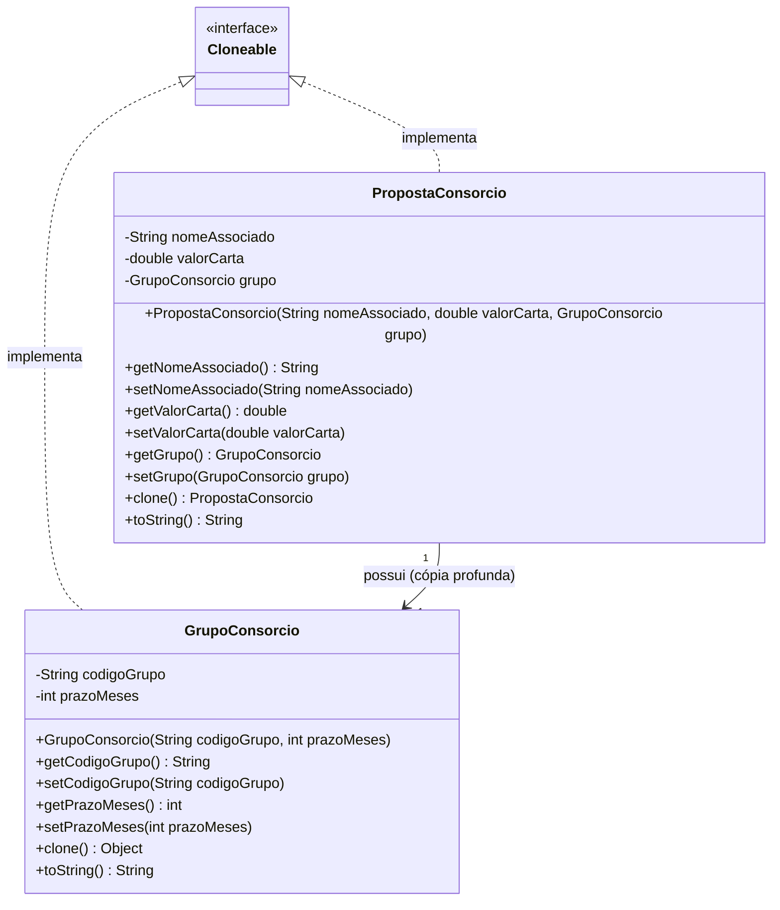

diagrama:

```mermaid

classDiagram
    class Cloneable {
        <<interface>>
    }

    class GrupoConsorcio {
        -String codigoGrupo
        -int prazoMeses
        +GrupoConsorcio(String codigoGrupo, int prazoMeses)
        +getCodigoGrupo() String
        +setCodigoGrupo(String codigoGrupo)
        +getPrazoMeses() int
        +setPrazoMeses(int prazoMeses)
        +clone() Object
        +toString() String
    }

    class PropostaConsorcio {
        -String nomeAssociado
        -double valorCarta
        -GrupoConsorcio grupo
        +PropostaConsorcio(String nomeAssociado, double valorCarta, GrupoConsorcio grupo)
        +getNomeAssociado() String
        +setNomeAssociado(String nomeAssociado)
        +getValorCarta() double
        +setValorCarta(double valorCarta)
        +getGrupo() GrupoConsorcio
        +setGrupo(GrupoConsorcio grupo)
        +clone() PropostaConsorcio
        +toString() String
    }

    Cloneable <|.. GrupoConsorcio : implementa
    Cloneable <|.. PropostaConsorcio : implementa
    PropostaConsorcio "1" --> "1" GrupoConsorcio : possui (cópia profunda)
```
